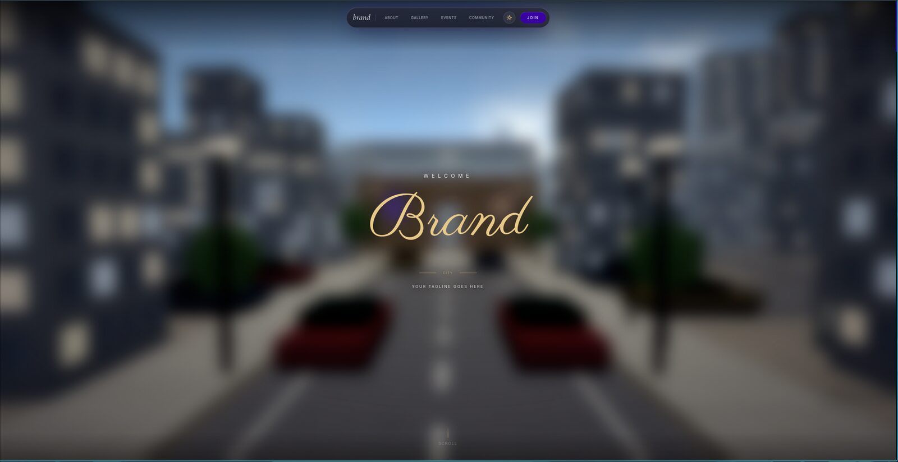
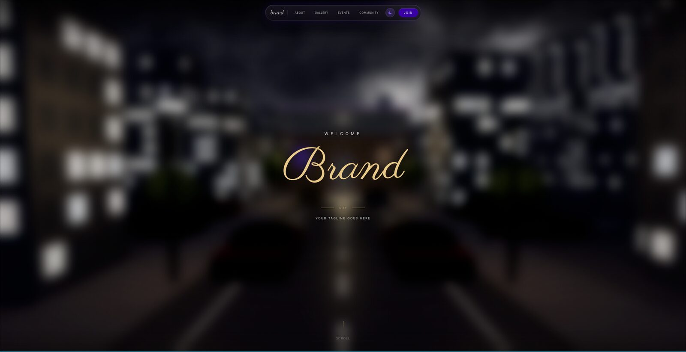
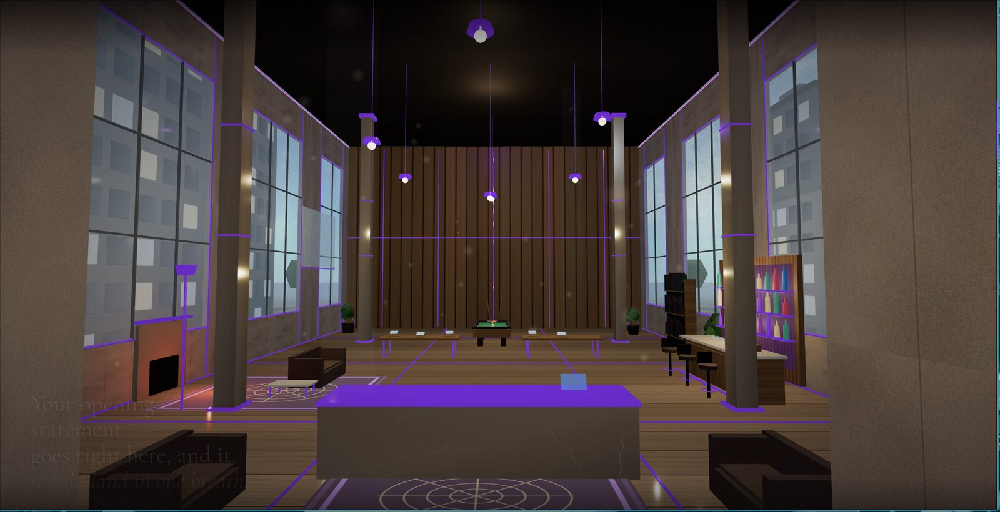

# Scroll-Driven 3D Website Template

> A cinematic single-page site where scrolling flies the camera through a procedurally
> built 3D room, from golden afternoon to deep night.

**[See the live demo →](https://3-d-template-website.vercel.app/)**

[](https://3-d-template-website.vercel.app/)

Everything the visitor reads lives in one file — **`site.config.ts`**. Fill it in and you
have your site. No 3D knowledge required.

<br>

## Quick start

```bash
npm install
npm run dev
```

Open <http://localhost:3000>, then edit **`site.config.ts`** — search for `TODO`, every
value you need to replace is marked.

<br>

## Night mode

A toggle in the nav flips the whole scene — sky, interior lighting and glass surfaces.





<br>

## What you get

- A **procedural 3D interior** — floor, walls, columns, coffered ceiling, pendant lights
  and a city skyline. No model files; it's all geometry in code.
- A **GLSL sky** that runs afternoon → sunset → twilight → night as you scroll, with
  clouds, a setting sun and stars. Interior warmth follows the sky.
- A **camera journey** on a spline: approach, cross the threshold, tour the room, settle.
- **Scroll-synced copy panels**, a tappable **photo stack**, **events** and **contact** cards.
- A **glass nav pill** with scroll-spy, day/night toggle and a full-screen mobile menu.

<br>

## Customising

### Content — `site.config.ts`

| Section | Controls |
|---|---|
| `brand` | Name, nav wordmark, tagline, location code |
| `seo` | URL, description, keywords, share image, theme colour, `indexable` |
| `nav` | Link labels, scroll targets, active windows |
| `journey` | `pages` — scroll length as a multiple of viewport height (default `9`) |
| `hero` | Eyebrow, cursive wordmark, tagline |
| `copyPanels` | Every text panel: copy, scroll window, alignment |
| `gallery` / `events` / `contact` | Headings and their items |
| `ui` | Small strings (scroll hint, mobile menu close label) |

Copy panels are array entries — add, remove or reorder freely:

```ts
{
  id: "value",
  start: 0.25, end: 0.37,        // scroll progress window (0–1)
  align: "right", valign: "center",
  rule: true,                    // thin glowing rule above the heading
  lines: [
    { text: "The second idea," },
    { text: "in three short lines.", accent: true },   // gold + italic
  ],
  caption: "SMALL CAPS SUPPORTING LINE",
}
```

`variant: "statement"` renders the lines as one large centred paragraph instead.

> **Keep the windows tidy.** `start`/`end` ranges shouldn't overlap unless you want two
> panels on screen at once, and the last panel should end at `1.0`.

### Images

Drop files into `public/gallery/` and list them in `gallery.images` — three or more,
rendered at their natural aspect ratio (mixing portrait and landscape is what gives the
stack its hand-placed look). Also replace `public/og-image.svg` (1200×630) and
`app/favicon.ico`.

### Colours and fonts

Design tokens live in `app/globals.css` under `:root`; change them there and the whole
site follows.

```css
--purple: #3900a4;        /* signature / interactive */
--orange: #fd6100;        /* rare — excitement only */
--gold:   #c9a96e;        /* luxury accent, hero wordmark */
```

Fonts are loaded in `app/layout.tsx` via `next/font/google` and exposed as `--font-sans` /
`--font-serif` / `--font-cursive`. The 3D scene has its own materials — see `MAT_*` in
`components/three/Architecture.tsx`, and `SkySystem.tsx` for the sky keyframes.

### Social icons

Add the key to the `SocialIconKey` union in `site.config.ts`, then the 24×24 SVG path to
`PATHS` in `components/SocialIcons.tsx`. Ships with `instagram`, `tiktok`, `youtube`, `x`,
`linkedin`, `facebook`, `discord`, `email`, `whatsapp`, `phone`, `globe`, `community`.

<br>

## Project structure

```
site.config.ts     ← ALL CONTENT LIVES HERE

app/               layout (fonts + SEO), page (composition), globals.css (tokens)
components/        Navigation, ScrollContent, Overlay, SocialIcons, CustomCursor…
components/three/  World, SkySystem, Architecture, Doorway, CameraRig, particles
lib/               scrollStore, themeStore, cameraPath, textures, device
```

<br>

## How the scroll system works

Scroll progress (0–1) lives in a plain object in `lib/scrollStore.ts` — **not** React
state — so Three.js can read it every frame without re-renders:

```ts
import { scrollState } from "@/lib/scrollStore";
// scrollState.progress   0–1
// scrollState.velocity   px/s
// scrollState.direction  1 | -1
```

Lenis updates it each scroll tick. Camera, sky, particles, overlay and panels all read
from that one source; panels write `opacity`/`transform` straight to the DOM.

To change *where the camera goes*, edit the spline control points in `lib/cameraPath.ts`.

<br>

## Tech stack

Next.js 16 (App Router, TypeScript strict) · Three.js + React Three Fiber v9 + drei v10 ·
Lenis v1.3 · Framer Motion + GSAP · Tailwind CSS v4

<br>

## Commands

```bash
npm run dev       # dev server on :3000
npm run build     # production build
npm run start     # serve the production build
npm run lint      # ESLint
npx tsc --noEmit  # type-check
```

<br>

## Deploying

Zero-config on **Vercel**. For a static host, add `output: "export"` to `next.config.ts`
and serve `out/`.

Set `seo.url` to your production URL before deploying, and keep `seo.indexable: false`
until launch.

<br>

## License

Released under the [MIT License](LICENSE) — free to use, modify and ship commercially,
including for client work. Keep the copyright notice; the template comes with no warranty.

Your own content — gallery images, copy, logo and brand — stays yours and isn't covered
by this license.
